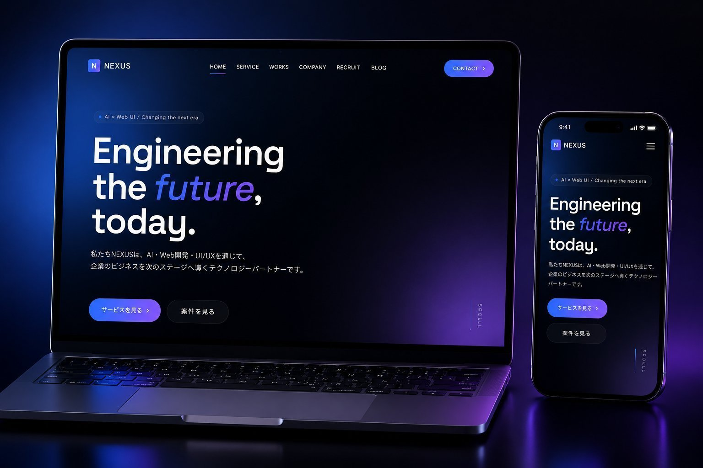

<div align="center">

# NEXUS Inc. — Web Renewal Proposal (v2)

**Engineering the future, today.**

架空のIT企業「NEXUS Inc.」のコーポレートサイト制作を題材にした、Web 制作企画書サイト。
ヒアリング想定からデザインコンセプト・スケジュール・概算見積もり・**運用KPI設計**までを、
全12ページ構成の企画書としてブラウザで閲覧できる形にまとめました。

<br />



<br />

[**📄 View Proposal**](https://hirotonozaki.github.io/nexus-corporate-proposal/) ・ [**🌐 Live Site**](https://hirotonozaki.github.io/nexus-corporate/) ・ [**📁 Repository**](https://github.com/hirotonozaki/nexus-corporate-proposal)

<br />


</div>

<br />

## 📖 Overview ／ 概要

「Webサイト制作の依頼を受けたら、自分はどのように考えて提案するか」を整理してみたくて制作した企画書サイトです。架空の IT 企業 NEXUS Inc. のコーポレートサイト新規制作を題材に、ヒアリング → 戦略設計 → 提案 → 制作 → 公開 → **運用** という流れのうち、**戦略設計から運用設計まで**をまとめています。

ここで提案している内容は、別リポジトリで [実装サイト](https://hirotonozaki.github.io/nexus-corporate/) として形にしました。「考えたことを実装まで運べるか」、さらに「**公開後の運用までイメージできているか**」を、2つの作品をセットで見ていただく構成にしています。

| Item | Detail |
| :--- | :--- |
| **Project Type** | Web 制作企画書(ポートフォリオ) |
| **Sections** | 全12ページ構成 |
| **Format** | HTML / CSS(A4・PDF 出力対応) |
| **Role** | 企画 / 情報設計 / デザイン / 実装 / 公開 / 運用設計 |
| **Stack** | HTML5 / CSS3(フレームワーク不使用) |
| **Hosting** | GitHub Pages |

<br />

## 🆕 What's New in v2

v2 では、初版の「**綺麗だけど少し作品感**」を、「**実務でも通用しそう**」のラインまで引き上げるため、以下を追加・改善しました。

| Section | Update |
| :--- | :--- |
| **02. 想定クライアント** | ヒアリングメモを引用形式で追加(現場の声) |
| **03. 現状課題** | 各課題に現状数値(CVR / 離脱率 / LCP 等)、6ヶ月後の目標値を追加 |
| **07. 使用技術** | 「なぜフレームワークを採用しないか」判断軸テーブルを追加 |
| **10. 運用・KPI設計** | **新規ページ**。KPI設計 / 運用フロー / 計測ツール / PDCAサイクル図 |
| **12. おわりに** | 提案メッセージブロック追加、注釈を圧縮、Source Code リンク追加 |

<br />

## 🛠 Tech Stack ／ 使用技術

| 領域 | 技術 |
| :--- | :--- |
| **Markup** | HTML5(12セクションを `<section class="page">` で構造化) |
| **Styling** | CSS3 / CSS Variables(`@page` / `@media print` 対応) |
| **Typography** | Inter / Space Grotesk / Noto Sans JP(Google Fonts) |
| **Hosting** | GitHub Pages |

> 実装サイト([nexus-corporate](https://github.com/hirotonozaki/nexus-corporate))と同じデザイントークン(`--color-accent: #4f8cff` / `--color-accent-2: #a06bff`)を採用し、ビジュアルトーンを完全に統一しています。

<br />

## ✨ Highlights ／ 工夫した点

### 1. 「考えて作れる人」を伝える章立て

「概要 → 課題 → ターゲット → 構造 → デザイン → 技術 → スケジュール → 見積もり → **運用** → おわりに」という順で章を組み立て、**設計から運用までを一貫して語れる**構成にしました。

| # | Section | 内容 |
| :--- | :--- | :--- |
| 00 | Cover | 表紙(クライアント・プロジェクト・日付・担当者) |
| 01 | Project Overview | プロジェクト概要・スコープ・ゴール |
| 02 | Client Profile | 想定クライアントのプロフィール + ヒアリングメモ引用 |
| 03 | Current Issues | 現状課題(数値根拠 + 6ヶ月後目標) |
| 04 | Target Design | ターゲット設定とカスタマージャーニー |
| 05 | Site Structure | サイトマップ・全7ページの役割定義 |
| 06 | Design Concept | トーン & マナー・カラー・タイポグラフィ |
| 07 | Tech Stack | 使用技術 + フレームワーク選定の判断軸 |
| 08 | Schedule | 8週間の制作スケジュール |
| 09 | Estimate | 概算見積もり・運用保守プラン |
| **10** | **Operation & KPI** | **KPI設計・運用フロー・計測ツール・PDCAサイクル(NEW)** |
| 11 | Published Site | 実装サイトのプレビュー・公開 URL・QR |
| 12 | Closing | 提案メッセージ・本提案のまとめ・担当者情報 |

### 2. Web 閲覧と PDF 配布の両立

ブラウザで開けば Web コンテンツとして、印刷すれば A4 の PDF として、ひとつの HTML で両方の用途に対応できるよう設計しました。

### 3. 実装サイトと完全に揃えたビジュアルトーン

カラー・タイポグラフィ・トーンを実装サイトと揃え、2つの作品で同じ世界観になるようにしました。

### 4. 「作って終わり」にしない運用視点

10章で **KPI設計・月次レポート・PDCAサイクル**まで設計し、「制作だけでなく公開後の成果にコミットできる体制」を提示しました。

<br />

## 📂 Directory ／ ディレクトリ構成

```
nexus-corporate-proposal/
├── index.html                 # 全12ページを単一 HTML で構成
├── proposal-v2.pdf            # 印刷出力済みPDF(配布用)
├── README.md
├── css/
│   └── proposal.css           # デザイントークン + 印刷対応 + v2追加スタイル
└── assets/
    └── images/
        ├── preview-mockup.png # 実装サイトのプレビュー
        └── qr-code.png        # 実装サイトへの QR
```

<br />

## 📄 PDF Output ／ PDF出力方法

本サイトは、**ブラウザの「印刷 → PDFに保存」でそのまま A4 の PDF になる**ように設計しました。本リポジトリにも `proposal-v2.pdf` を同梱しています。

### PDF化の手順

```
1. https://hirotonozaki.github.io/nexus-corporate-proposal/ を開く
2. ブラウザの印刷ダイアログを起動(Ctrl/Cmd + P)
3. 送信先を「PDFに保存」に設定
4. 用紙サイズ A4 / 余白なし / 背景グラフィックON で保存
```

<br />

## 🔗 Related ／ 関連リポジトリ

| Repository | Description |
| :--- | :--- |
| 📄 **nexus-corporate-proposal**(本リポジトリ) | NEXUS Inc. コーポレートサイト制作 企画書 |
| 🌐 [**nexus-corporate**](https://github.com/hirotonozaki/nexus-corporate) | 企画書をもとに実装したコーポレートサイト本体 |

<br />

## 👤 Author ／ 制作者情報

<div align="center">

### **Hiroto Nozaki**

Web Production / Front-end

[](https://github.com/hirotonozaki)
[](https://hirotonozaki.github.io/hiroto-nozaki-portfolio/)

</div>

<br />

<div align="center">

> 本企画書はポートフォリオ用に制作した架空企業のデモ案件であり、実在する組織・事業とは関係ありません。
> 記載の課題・スケジュール・見積もり金額はすべてデモコンテンツです。

<sub>© 2026 Hiroto Nozaki</sub>

</div>
